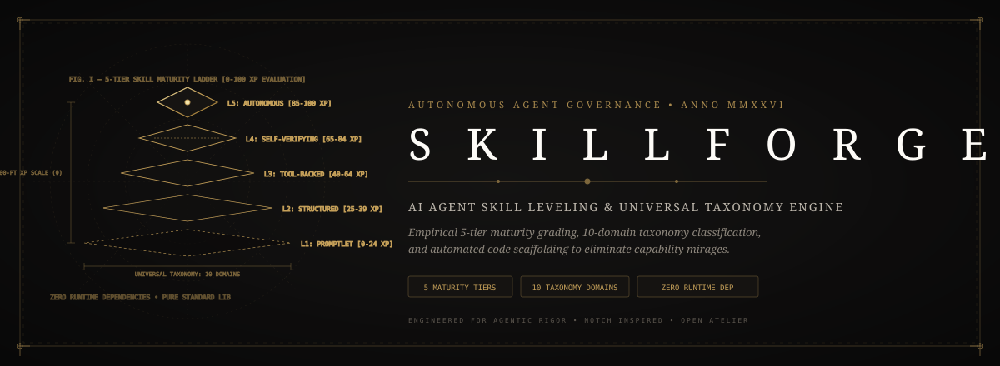
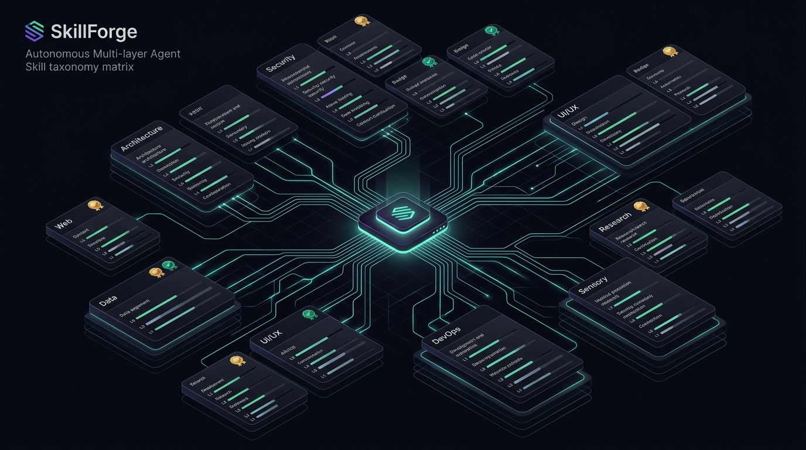

<div align="center">

# 🛡️ SkillForge
### The Open-Source AI Agent Skill Leveling & Universal Taxonomy Engine

[](LICENSE)
[](https://python.org)
[](docs/LEVELING_SPEC.md)
[](DEPENDENCIES.md)
[](tests/)

<p align="center">
  
</p>

**SkillForge** is the definitive framework for **grading, categorizing, and upgrading AI agent skills**.  
It scans any directory of premade skills, maps them across a **10-domain taxonomy**, evaluates maturity from **Level 1 (Promptlet)** to **Level 5 (Autonomous Master)**, and generates automated code scaffolds to level them up.

</div>

---

## 🌟 Why SkillForge?

As modern AI agent systems scale across **Antigravity, Claude Code, Cursor, Windsurf, Codex, and OpenCode**, developer skills have exploded into thousands of uncurated markdown files.

Most skill repositories suffer from two critical failures:
1. **The Capability Mirage**: A prompt marked "expert" is often just a raw text snippet with zero deterministic tests or safety guardrails.
2. **Taxonomy Chaos**: Skills are dumped into flat lists without domain classification, hazard profiling, or compatibility validation.

**SkillForge solves both** through an empirical 5-tier evaluation rubric and automated multi-vector taxonomy engine.

---

## 🏛️ The 5-Tier Skill Maturity Hierarchy

SkillForge evaluates any skill on a **100-Point XP Scale** across five orthogonal dimensions:

```
┌────────────────────────────────────────────────────────────────────────┐
│ 👑 Level 5: Autonomous Master  (85-100 XP) Closed-loop & Telemetry     │
├────────────────────────────────────────────────────────────────────────┤
│ 💎 Level 4: Self-Verifying     (65-84 XP)  Automated Tests & AST Guard │
├────────────────────────────────────────────────────────────────────────┤
│ 🥇 Level 3: Tool-Backed Adept  (40-64 XP)  Executable Python/CLI Tools │
├────────────────────────────────────────────────────────────────────────┤
│ 🥈 Level 2: Structured Standard(25-39 XP)  YAML Schema & Clean Markdown│
├────────────────────────────────────────────────────────────────────────┤
│ 🥉 Level 1: Novice Promptlet   (0-24 XP)   Raw Snippet / Unstructured  │
└────────────────────────────────────────────────────────────────────────┘
```

| Tier | Badge | Definition & Requirements | Operational Risk |
| :--- | :--- | :--- | :--- |
| **Level 1** | 🥉 `L1-PROMPTLET` | Free-form prompt or unstructured markdown. No YAML frontmatter, no code backing. | High (Drift & Hallucination) |
| **Level 2** | 🥈 `L2-STANDARD` | Structured `SKILL.md` with valid YAML frontmatter, H2 headings, and contextual triggers. | Low reasoning hazard |
| **Level 3** | 🥇 `L3-TOOL-BACKED` | Backed by standalone executable scripts (`scripts/`, `tools/`), CLI args, parameter schemas. | Deterministic execution |
| **Level 4** | 💎 `L4-VERIFIED` | Includes automated test suite (`tests/`), AST linting, `CREATE_NO_WINDOW` OS isolation. | Safe & Verified |
| **Level 5** | 👑 `L5-AUTONOMOUS` | Closed-loop self-healing, multi-agent protocol, state persistence (Blackboard), telemetry. | Production Zero-Entropy |

---

## 🗺️ Universal 10-Domain Taxonomy Matrix

SkillForge automatically classifies skills into 10 primary operational domains:



1. **`agent-architecture`**: Swarms, hypervisor scheduling, supervisor meshes, council deliberation, blackboard routing.
2. **`software-engineering`**: Test-driven development, AST inspection, refactoring, git diffs, clean code.
3. **`security-sandbox`**: AST linting, secret detection, windowless subprocesses (`0x08000000`), safe exec.
4. **`web-harvesting`**: Scrapling, Playwright, stealth crawlers, DOM extractors, social media harvesting.
5. **`data-knowledge`**: SQLite WAL, vector embeddings, FTS5 semantic search, graph memory, Obsidian vaults.
6. **`ui-ux-craft`**: Emil Kowalski tactile physics, Atelier luxury aesthetics, anti-slop filters, claymorphism.
7. **`devops-platform`**: Windows/Linux process management, PowerShell debloating, daemons, `uv`/`pip`.
8. **`research-analysis`**: ArXiv paper synthesis, academic ideation, literature reviews, ground truth harvesting.
9. **`multimodal-sensory`**: Whisper speech-to-text, voice synthesis, image generation, vision models.
10. **`workflow-productivity`**: Task observation, LinkedIn growth, Telegram remote bridges, sprint briefings.

---

## ⚡ Quickstart

SkillForge requires **Python 3.10+** and uses **standard library only** (0 external runtime dependencies).

### 1. Installation
```bash
git clone https://github.com/Jaswanth1902/SkillForge.git
cd SkillForge
pip install -e .
```

### 2. Scan an Entire Skill Directory
```bash
# Scan default .agents/skills or any local directory
skillforge scan path/to/skills
```

### 3. Evaluate a Single Skill
```bash
skillforge rate task-observer
```
*Output:*
```text
=================================================================
🛡️  SKILL EVALUATION REPORT: task-observer
=================================================================
File Path    : .agents/skills/task-observer/SKILL.md
Domain       : workflow-productivity
Maturity     : 🥇 L3-TOOL-BACKED (Level 3: Tool-Backed Adept)
XP Score     : 62 / 100
Risk Profile : SAFE
Scripts      : 2 found | Tests: 0 found
-----------------------------------------------------------------
CRITERIA SCORE BREAKDOWN:
  • Structure And Frontmatter      : 15 pts
  • Executable Tooling             : 20 pts
  • Safety And Verification        :  5 pts
  • Trigger And Guidance           : 12 pts
  • Autonomy And Resilience        : 10 pts
-----------------------------------------------------------------
GAPS BLOCKING NEXT LEVEL:
  [!] Must create automated test suite (pytest in tests/) to reach Level 4
```

### 4. Level Up a Skill
```bash
skillforge levelup anti-slop
```
*Output: Generates actionable steps and drop-in code scaffolds for the immediate next tier.*

### 5. Generate Catalogs & HTML Dashboards
```bash
# Export Markdown catalog
skillforge catalog .agents/skills --output CATALOG.md

# Export Dark-Mode Interactive HTML Dashboard
skillforge catalog .agents/skills --html DASHBOARD.html

# Export JSON Index
skillforge catalog .agents/skills --output skills_index.json --json
```

---

## 🧪 Testing & Verification

SkillForge maintains 100% test coverage using standard `pytest`:

```bash
pytest tests/ -v
```

All 17 test suites verify:
- ✅ **Model serialization & Enums**
- ✅ **Multi-vector taxonomy classifier & risk profiler**
- ✅ **5-tier leveling rubric & XP calculation**
- ✅ **Universal file-system scanner & frontmatter parser**
- ✅ **CLI commands (`scan`, `rate`, `levelup`, `catalog`, `taxonomy`)**

---

## 📜 Documentation

- [**5-Tier Leveling Specification**](docs/LEVELING_SPEC.md)
- [**10-Domain Taxonomy Ontology**](docs/TAXONOMY_ONTOLOGY.md)
- [**CLI Reference Manual**](docs/CLI_REFERENCE.md)
- [**Project Rules & Invariants**](PROJECT_RULES.md)
- [**Dependencies & Runtime Manifest**](DEPENDENCIES.md)

---

## 📄 License

MIT © 2026 Antigravity Engineering & Jaswanth Kannali
